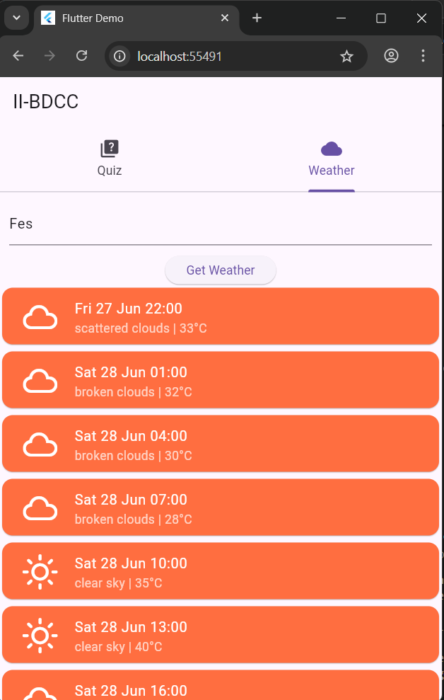
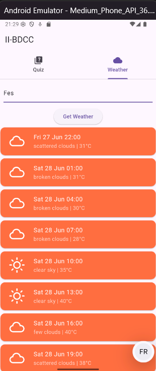

# 📱 DEMO_APP – Flutter Quiz & Weather App

This is a Flutter-based mobile application that combines two main features:
- ✅ A simple interactive **Quiz App** for user engagement.
- 🌦️ A **Weather App** that fetches real-time weather data using OpenWeather API.

---

## 📂 Project Structure

```
lib/
├── main.dart
├── answer.dart
├── question.dart
├── quiz.dart
├── score.dart
├── weather.dart
```

---

## 🚀 Features

### 🎯 Quiz Module
- Multiple questions and answer choices
- Dynamic score tracking
- Feedback on selected answers

### ☁️ Weather Module
- Uses `OpenWeatherMap API` to fetch current weather
- Displays temperature, description, and city-specific data
- API key is loaded securely from `.env` file

---

## 🔑 Environment Variables

Create a `.env` file in the root with the following format:

```env
OPENWEATHER_API_KEY=your_api_key_here
```

---

## 📦 Dependencies

- flutter_dotenv
- http

Install them with:

```bash
flutter pub get
```

---

## ▶️ Running the App

```bash
flutter run
```

---

## 📸 Screenshots








## 🧠 Author

**Saif Dine Hassidou** 
